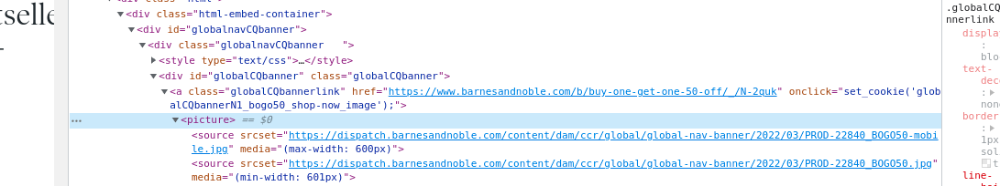

# Scrapy-Webscraper-Pipeline

### Webscraper Pipeline created using Scrapy, PostgreSQL and "Dockerized"

Last time I webscrape some data into a PostgreSQL database, the tool I was using
was BeatifulSoup. It was a really good way to  learn how to extract, transform and load information since
is a really simple and easy way to do it. Now that I had a little more experience creating ETLs and
webscraping, it was time to use Scrapy Pipeline and learn how to connect PostgreSQL through Python.

The project took me a couple of days to figure out connection and ways to add
items to databases and also learning to work with 'psycopg2' and the proper way to
format the SQL queries through Python.

The last couple of days I was researching ways to connect different containers in Docker so when the application was
started in Docker it could store data into another container that was running PostgreSQL.

## How it was done
Sitecraped: [HERE](https://www.barnesandnoble.com/b/books/_/N-1fZ29Z8q8?Nrpp=20&page=1)
Stack: Python, Scrapy and PostgreSQl

Tested in Docker.

Here is the [log](https://medium.com/@obedlaws_logs/3-9-22-a-new-web-scraping-pipeline-w-scrapy-452ba6a51c89) of how it was done and my thought process!
